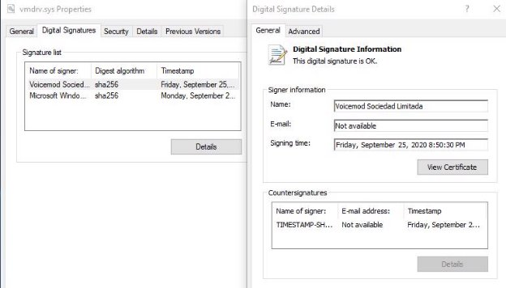
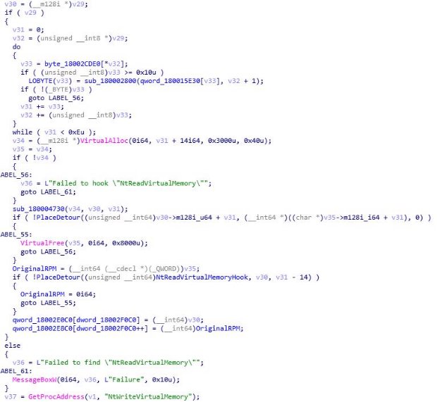
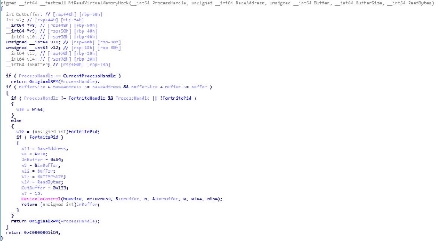

# A Formal Analysis of The Average (Detected) Fortnite Cheat

0day @ IZI team 

yatzu#7293

Explaining why anti-cheats are winning the mouse-cat game 

# Abstract
The game cheats market during the years has changed a lot. Cheats developers and anti-cheats have been evolving\
together every year because of the cat and mouse game; before most games (especially FPS) were filled with\
working and undetected cheats that were ruining everyone’s game experience, but now we’ve came to a point\
where anti-cheats have stopped looking at singular cheats and started thinking more generally, using techniques\
that wouldn’t target a single product but instead would detect a bunch of cheats together, and that simply works\
better then before.

Technically speaking, the previous widely used by anti-cheats SBD(Signature-based scanning) method got day after\
day less utilized, and more general techniques such as finding unsigned kernel code running(by scanning threads\
stacks, for example), finding unlisted memory onto the game process, or simply analyzing the behaviour of a\
system (in the most advanced case) instead took place.

Of course SBD still play an important role, just not as important as before.

# Introduction
In this article we will describe the methods used by a cheat being advertised as “undetected” named “BattleFN” by\
its developer. Seeing the public methods used by the cheat, I hope the developer doesn’t believe his own words\
but just says it for the sake of scamming users. But I highly believe that he thinks his cheat actually is undetected,\
seeing the developer’s ego when writing to his customers how “my driver is the most undetected one”

# Loader overview
Once we buy a key from their resellers, we get a download link to a VMProtect protected executable with all\
protections options used.

It’s funny to see the attempt to lead a possible reverser to the wrong direction when a debugger has been found;\
he has edited the VMProtect standard messages from the packer from “A debugger has been found” or “A virtual\
machine has been found” to “Loader needs an update”.

After running the loader, it tells us that an update has been downloaded on the current directory and that we have\
to run the new one. This process has to be done 3 or 4 times, because every new downloaded loader downloads a\
new one which isn’t the newest, until the newest has been downloaded.

This happens because the owner doesn’t even have a proper version check and doesn’t even have his own host to\
distribute the needed cheat modules; we’ll see that last statement later.

The finally updated loader then asks us for an activation key; we put in the just bought key and it leads us to\
choose the option to load the cheat.

# Cheat components
Once we choose to load the cheat, a few PEs gets downloaded to our PC.

1. vmdrv.sys – Voicemod Virtual Audio Device (WDM)\
A legit signed driver developed by “Voicemod Sociedad Limitada” that the cheat developer uses in order\
to have a user-kernel communication for reading/writing to Fortnite process memory.

1. (Random driver name here) – A driver that manual map another driver\
A VMProtect protected kernel-mode driver that manual map a driver located in “C:\driver.sys” and\
unloads after

1. “C:\driver.sys” – The manual mapped cheat driver\
A small driver that hijacks vmdrv.sys DeviceObject->DeviceExtension in order to provide a communication\
window with the cheat executable. We will talk about how it works later

1. Cheat executable\
Another VMProtect protected executable that contains the whole cheat.\
It is being started using process hollowing technique (RunPE) from the main loader executable, with the\
Windows Task Manager (Taskmgr.exe) process being the target process.\
It contains the whole cheat, with all the features.

1. An usermode DLL module that does I/O with the cheat driver\
This does I/O with the cheat driver, it is being downloaded by the cheat executable and loaded inside it.\
The job is to do I/O with the manual mapped cheat driver in order to read or write memory of Fortnite\
protected process

# Working mechanism
The working mechanism it’s pretty straightforward and it’s nowhere near to be undetected in any of the aspects\
from EasyAntiCheat or BattleEye.

The main loader acquire SeLoadDriverPrivilege in order to download (from a discord attachment link), drop to disk\
and load vmdrv.sys driver using NtLoadDriver.

It then download (always from a discord attachment link) and drop to disk a kernel driver that is signed with a valid\
asian certificate (most likely leaked) and loads it as well with NtLoadDriver.

This driver purpose is just to manual map another driver and unload itself as described already in the components.

The first thing it does is deleting the service registry key with ZwDeleteKey. Then, it read a driver that has to be\
placed in “C:\driver.sys” and manual map it. Once done, in the DriverEntry, it returns a status code which isn’t\
STATUS_SUCCESS, so that Windows automatically unload the driver.

I’ve seen that it also search for some patterns in ntoskrnl.exe and CI.dll, probably in order to clean its artifacts from\
known cache lists such as PiDDB or kernel hash bucket list, but I am not sure as I didn’t bother checking this part.

The new manual mapped driver hijacks vmdrv.sys DeviceObject->DeviceExtension; The reason why this driver does\
that is simply explained below with a screenshot

This screenshot, taken from IoControl dispatch routine of vmdrv.sys, shows how if you send an IOCTL command\
with the id 0x1D201B, the get a pointer stored in its device extension.

This is actually the most interesting idea the developer had, I can’t call EasyAntiCheat or BattleEye checking for\
such stuff, as DeviceExtension can be used for any scope by drivers and you really cannot distinguish the content of\
one from being used for malicious purposes, unless you add specific rules for specific drivers.

TLDR: The cheat driver is giving the external a window to access Fortnite process.

The loader, will now download the real cheat executable. On a sidenote, the manualmapper driver and the real\
cheat executable are ciphered with a progressive XOR algorithm.

The main loader then requires you to open Fortnite and once in lobby, press a key in order to drop and start the\
real cheat process. I wont comment this part, I mean the part where a plain cheat process has to remain in\
memory until the user decide whether to “inject” or not.

Once the user finally pressed the key, the main loader will use the process hollowing technique (commonly called\
RunPE) with the target process being Windows Task Manager process (Taskmgr.exe) and the real process being the

external process. Worth to mention that the customer’s activation key is being passed as parameter in the\
command line in CreateProcess.

The cheat external process in the main routine (virtualized using VMProtect) downloads a DLL module and load it.

The user-mode DLL module is responsible as mentioned above in the components for I/O with the hijacked IOCTLs\
routines in vmdrv.sys.

It first hooks a bunch of routines (most relevant ones are NtRead/WriteVirtualMemory) in the cheat process, in\
order to redirect the control flow of those functions to a routine inside the DLL itself, then open the named device\
object that vmdrv.sys creates in DriverEntry using CreateFile.

DLL component hooking various NT APIs

Example of hooked NtReadVirtualMemory inside the cheat process 

The developer has copied and pasted the model of the open-source project https://github.com/btbd/access model\
(easily recognizable from the PDB path in the PE debug directory), and modified It, so that when the cheat calls\
ReadProcessMemory (or any of the hooked routines) on Fortnite process handle, instead of executing the syscalls,\
the hooked routine calls DeviceIoControl to do I/O with the cheat driver so that it can successfully read Fortnite\
protected process memory.

# Detection vectors
Pretty much all of the mechanism of the cheat are already detected by EAC/BE, but the most obvious are those\
two

1. Keeping the main loader opened without any sort of precaution and letting the user inject the cheat once\
he is in lobby it’s like playing Russian Roulette: EAC/BE might not be detecting the cheat for this, but they\
list running processes and have rules for detecting some externals;

1. The cheat executable has no protection at all, using the process hollowing technique on Windows Task\
Manager is not definitely the way to go to hide the artifacts of an executable process.\
The executable also creates a standard, copy and pasted, DirectX9 overlay for rendering the visuals and\
for example BattleEye is already enumerating windows and searching for overlays build exactly the way\
this cheat does. Not sure also how task manager having an overlay window created makes it more\
undetected then a random process making it.

# Conclusions

This is actually a more-then average cheat that you can find in Fortnite “black-market”, I’ve seen much worse\
cheats costing more then this one, and this is the reason why even if the market is filled of cheats, they are mostly\
all already detected or are just waiting for anti-cheats developers to push a new rule based on received logs. This is\
why the anti-cheats are (mostly) winning the cat and mouse game.

As mentioned in the introduction, this cheat is already detected (plenty of customers reporting bans everyday as\
proof) surely since the first day of its life, and surely not EAC or BE have done anything specific to it in order to\
detect it (just think about BE shellcode to detect overlays)

# Extra: cheat modules
**Note: the modules are surely already outdated as the developer is pushing more then an update per day. The drivers and the user-mode cheat module, however, are actual as the updates I’ve been seeing through those days were just about the main loader and the external cheat.**

## How to inject the cracked cheat
1. Extract all in the SAME DIRECTORY
1. Go in your C:\\ Directory, and put Driver.sys

1. create a batch file with this content :

sc create VOICEMOD_Driver binpath="PATH_TO_VM_DRV\vmdrv.sys" type=kernel
sc start VOICEMOD_Driver
sc delete VOICEMOD_Driver
sc create AJIFHJ24981 binpath="PATH_TO_DRV\AJIFHJ24981.sys" type=kernel
sc start AJIFHJ24981
sc delete AJIFHJ24981
pause

1. Run battlefn_crack.exe
